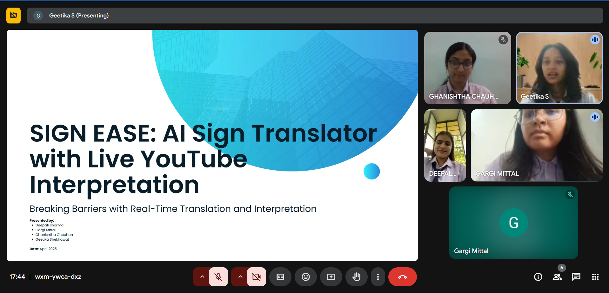
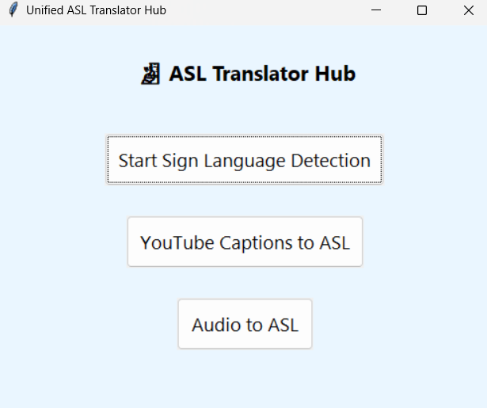
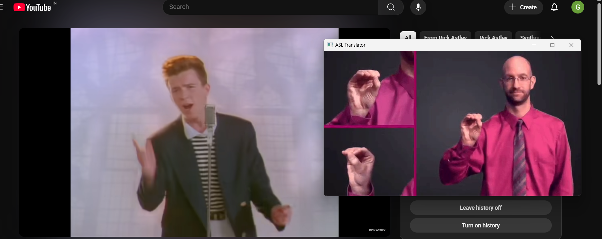
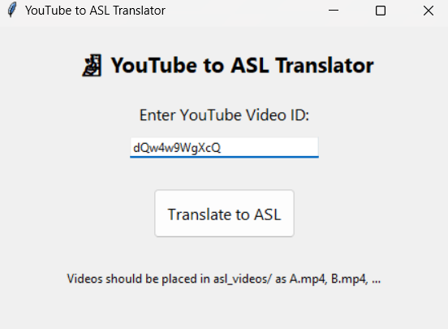
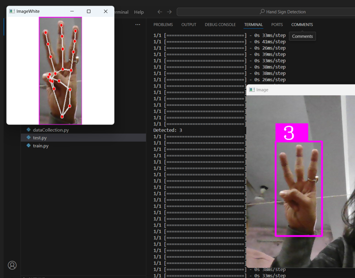
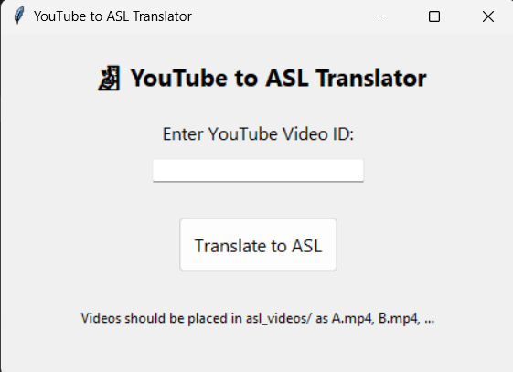
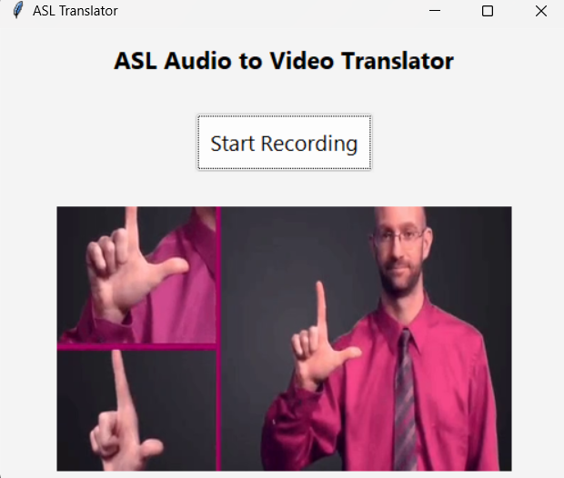
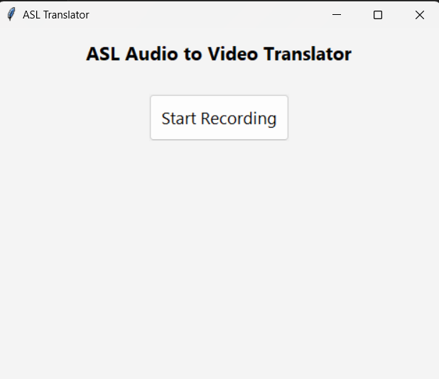

# Signease: Unified ASL Translator Hub

**Signease** is a user-friendly desktop application that brings together multiple American Sign Language (ASL) translation tools into a single interface.

---


## 💡 Features

1. **Sign Language to Audio Translator**  
   Uses hand gesture recognition from a webcam to detect ASL letters and speak them aloud.

2. **YouTube to ASL Interpreter**  
   Fetches captions from YouTube videos and displays corresponding ASL letter animations using pre-stored sign videos.

3. **Audio to ASL Translator**  
   Listens to audio from the microphone and displays matching ASL signs as videos.

---

## 🐍 Python Version

- Requires **Python 3.7 or higher**  
  (Recommended: Python 3.10+ for best package support)

---

## 📦 Installation & Requirements

Install all dependencies using:

```bash
pip install -r requirements.txt
```

Or manually install them:

```bash
pip install tk opencv-python cvzone numpy mediapipe pyttsx3 SpeechRecognition youtube-transcript-api pillow
```

### `requirements.txt` content:

```
tk
opencv-python
cvzone
numpy
mediapipe
pyttsx3
SpeechRecognition
youtube-transcript-api
pillow
```

---

## 🗂️ Folder Structure

```
signease/
│
├── main.py                  # GUI launcher
├── prediction1.py           # Camera-based sign detection
├── ytasl2.py                # YouTube video to ASL
├── AudioToASL.py            # Audio to ASL translator
├── M/
│   ├── keras_model.h5       # Trained sign language model
│   └── labels.txt           # Labels used in classification
├── gifs/
│   ├── A.mp4, B.mp4, ...    # ASL sign videos for each letter
├── requirements.txt
└── README.md
```

---

## 🚀 Running the App

Launch the hub interface:

```bash
python main.py
```

Then select one of the translator tools from the GUI.

---

## 📝 Notes

- Ensure your webcam and microphone are properly connected.
- Store ASL sign videos for each alphabet as `A.mp4`, `B.mp4`, ... inside a folder named `gifs/`.
- Trained model and label files should be inside the `M/` directory.

---
## 🖼️ Gallery

<p align="center">
  
  <br>
  
  <br>
   
  <br>
 

</p>

---

## 🔮 Future Improvements

- Add support for full-word translation.
- Use deep learning models for improved accuracy.
- Add support for real-time ASL feedback overlay on videos.

---

## 📜 License

This project is open source under the [MIT License](LICENSE).
